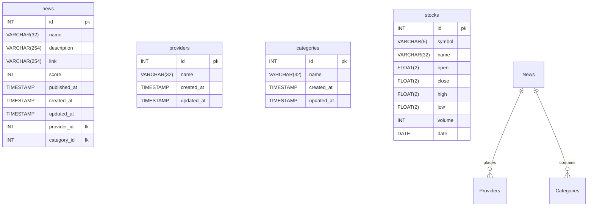

# DB Table

```mermaid
erDiagram
    news {
        INT id pk
        VARCHAR(32) name
        VARCHAR(254) description
        VARCHAR(254) link
        INT score
        TIMESTAMP published_at
        TIMESTAMP created_at
        TIMESTAMP updated_at
        INT provider_id fk
        INT category_id fk
    }
    providers {
        INT id pk
        VARCHAR(32) name
        TIMESTAMP created_at
        TIMESTAMP updated_at
    }
    categories {
        INT id pk
        VARCHAR(32) name
        TIMESTAMP created_at
        TIMESTAMP updated_at
    }
    stocks {
        INT id pk
        VARCHAR(5) symbol
        VARCHAR(32) name
        FLOAT(2) open
        FLOAT(2) close
        FLOAT(2) high
        FLOAT(2) low
        INT volume
        DATE date
    }

    News ||--o{ Providers : places
    News ||--o{Categories : contains
```
