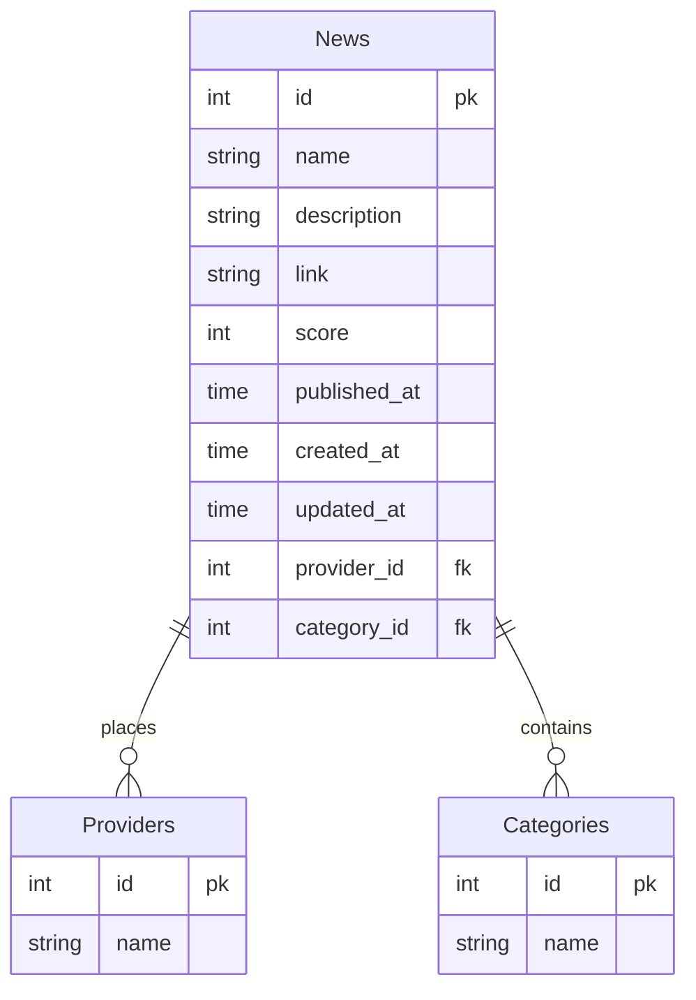

# DB Table

```mermaid
erDiagram
    News {
        int id pk
        string name
        string description
        string link
        int score
        time published_at
        time created_at
        time updated_at
        int provider_id fk
        int category_id fk
    }
    Providers {
        int id pk
        string name
    }
    Categories {
        int id pk
        string name
    }

    News ||--o{ Providers : places
    News ||--o{Categories : contains
```
