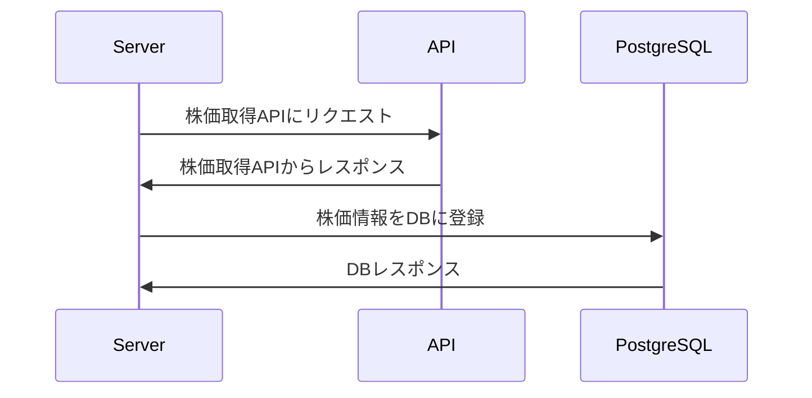

# Design Docs

## 1. 概要

- **目的**: 金融に関する情報をLine Botで定期的に送信するサービス

- **対象読者**: 金融リテラシーが低く、金融の知識を深めたいユーザー

## 2. 背景

### 金融ニュースをユーザーに届けるサービス

金融リテラシーを高めたいニーズがある一方、金融のニュースを確認する習慣を身につけるのがハードルが高いという現状がある。

もっと気軽に金融系のニュースを確認できるサービスを提供することで習慣化し、金融リテラシーを高めたいという思いから発案された。

## 3. 目的

ユーザーが求める金融情報を提供し、金融リテラシーを高める。

## 4. 要件

## 4.1 機能要件

- **機能1**: 一日最大三件の重要な金融ニュースの通知
- **機能2**: その日の最もイケてる株,FX,投資信託,暗号資産などの銘柄の情報の通知
- **機能3**: 株などのシミュレーション機能
- **機能4**: アフィリエイト広告

## 4.2 非機能要件

- **パフォーマンス**: ユーザーの通知が予定の10分を超えない程度のパフォーマンス
- **セキュリティ**: ユーザーの個人情報が漏洩されないこと。また、必要以上に保持しない。
- **拡張性**: 高負荷に耐えられるように基本的に分散アーキテクチャを採用する。

## 5. システムアーキテクチャ

[diagram](https://app.diagrams.net/?src=about#G1u6J3T5kn-cB-85117u00gpe_KJAJez7F)

### ニュース送信のフロー


### 定期実行バッチ

ニュースや銘柄などのデータ取得のバッチ

<!--  -->



## 6. 主要な技術スタック

使用する技術やツール、ライブラリ、フレームワークについて記述します。

### RDBS

- [Postgresql](https://www.postgresql.org/)

- [sqlc](https://docs.sqlc.dev/en/stable/tutorials/getting-started-postgresql.html)

- [goose](https://github.com/pressly/goose)

### Cache

- [etcd](https://etcd.io/)

- [etcd/client/v3](https://github.com/etcd-io/etcd/tree/main/client/v3)

### Message Que

- [Appache Kafka](https://kafka.apache.org/)

- [sarama](https://github.com/IBM/sarama)

## 7. インターフェース

システムが提供するAPIや、外部システムとのインタフェースについての詳細を記述します。

### Line API

Line登録しているユーザーなどにニュースを送る。

- [Line](https://developers.line.biz/ja/docs/messaging-api/building-bot/)

### API

- [News API](https://newsapi.org/)

### RSS

#### News

- [Yahoo Japan](https://news.yahoo.co.jp/rss)
- [Google](https://support.google.com/googlenews/?hl=ja&visit_id=638308175180189562-3062086800#topic=7688381)
  - https://rss.app/rss-feed/google-news-rss-feed
  - https://g-tips.jp/google-news/how-to-get-google-news-rss/
  - https://support.google.com/news/publisher-center/answer/9545414?hl=en

## 8. 制約事項

システムの設計や実装における制約や制限事項を明記します。

### ディレクトリ構成

以下の思想を参考に設計します。

- [Standard Go Project Layout](https://github.com/golang-standards/project-layout/blob/master/README_ja.md)
- [Domain-Driven Design](https://learn.microsoft.com/en-us/archive/msdn-magazine/2009/february/best-practice-an-introduction-to-domain-driven-design)

```zsh
project-name/
├── api/                  # API定義とプロトコルファイル
├── build/                # ビルドとデプロイのスクリプト
├── cmd/                  # プロジェクトのエントリーポイント (main.goファイル)
├── configs/              # 設定ファイル
├── deployments/          # KubernetesやDockerのデプロイメント設定
├── docs/                 # ドキュメント
├── images/               # Dockerfile
├── internal/             # 内部パッケージ
│   ├── app/              # アプリケーションロジック
│   ├── dao/              # データアクセスオブジェクト (DAO)
│   ├── middleware/       # ミドルウェア
│   ├── model/            # データモデル
│   └── service/          # サービスレイヤ
├── pkg/                  # 外部で利用可能なライブラリやパッケージ
├── scripts/              # スクリプト (データベースマイグレーション、セットアップスクリプトなど)
├── test/                 # 追加の外部テストアプリケーションとテストデータ
├── third_party/          # サードパーティのユーティリティ
├── web/                  # Webサーバと関連ファイル
├── .gitignore            # git ignoreファイル
├── Makefile              # ビルド、テスト、デプロイメントを自動化するためのMakefile
├── README.md             # プロジェクトのREADME
└── go.mod                # Goのモジュール依存関係
```

## 9. マイルストーンとタイムライン

プロジェクトの主要なフェーズや、それぞれのフェーズの完了予定日を明記します。

## 10. その他の注意事項

その他、関係者が知っておくべき情報や注意事項を記述します。
